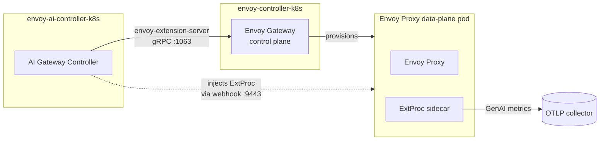
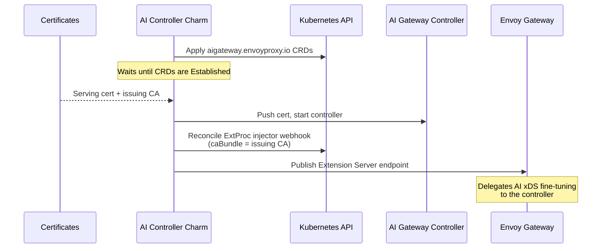

# Envoy AI Gateway Controller

The Envoy AI Gateway Controller charm (`envoy-ai-controller-k8s`) deploys and
operates the [Envoy AI Gateway](https://aigateway.envoyproxy.io/) control plane.
It extends an [Envoy Gateway](https://gateway.envoyproxy.io/) control plane with
AI-specific routing (LLM provider backends, token rate limits, and GenAI request
metrics) without the base gateway needing to know anything about AI.

The charm owns the `aigateway.envoyproxy.io` CRDs and the ExtProc
sidecar-injector webhook, and serves the Envoy Gateway Extension Server protocol
so the control plane can delegate AI-specific xDS fine-tuning to it.

## Relations

The order in which these are established does not matter. The charm reconciles
whenever the picture changes.

| Connects To | Interface | What It Does |
|-------------|-----------|--------------|
| **envoy-controller-k8s** | `envoy_extension_server` | Advertises this controller's Extension Server gRPC endpoint. This relation is the AI on/off switch: once related, the Envoy Gateway control plane delegates AI xDS fine-tuning here. |
| **A certificates provider** (e.g. `self-signed-certificates`) | `tls-certificates` | Issues the serving cert for the ExtProc admission webhook. Required: the charm blocks until it is established. |
| **An OTLP collector** | `otlp` | Endpoint the injected ExtProc sidecars push GenAI metrics to. Optional. |
| **COS** | `grafana_dashboard`, `prometheus_scrape` | Ships the LLM-consumption dashboard and scrapes the controller's metrics. |

## How It Works

The controller runs as a Pebble workload in the `ai-gateway` container. On top of
running the binary, the charm wires it into the surrounding gateway:

1. It applies the `aigateway.envoyproxy.io` CRDs and waits until they are
   `Established`. The controller indexes these at startup and exits if they are
   missing.
2. It serves the **Extension Server** (gRPC, `:1063`). When related to
   `envoy-controller-k8s`, the base control plane calls this endpoint to have
   AI-specific config merged into the xDS it hands its proxies.
3. It manages an **ExtProc sidecar-injector** webhook (`:9443`). On pod CREATE,
   the webhook stamps an ExtProc sidecar into Envoy Gateway data-plane pods
   (scoped to `app.kubernetes.io/managed-by=envoy-gateway`); that sidecar does
   the per-request LLM processing and emits GenAI metrics.

## Lifecycle

## CRDs

The `aigateway.envoyproxy.io` manifests under `src/crds/ai-gateway/` are vendored
from [envoyproxy/ai-gateway](https://github.com/envoyproxy/ai-gateway) v0.6.0,
matching the `ai-gateway-image` resource tag in `charmcraft.yaml`.

To update: bump the resource tag, re-copy the CRD manifests from the matching
upstream release, and update `DEFAULT_TAG` in `src/charm.py` (a unit test asserts
these stay in sync).

## Configuration

See [`charmcraft.yaml`](charmcraft.yaml), or
[the charm on Charmhub](https://charmhub.io/envoy-ai-controller-k8s), for all
config options.
