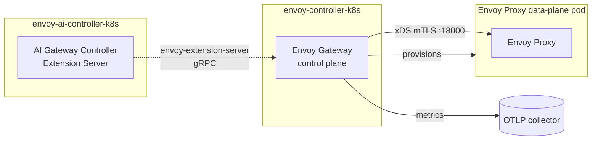

# Envoy Gateway Controller

The Envoy Gateway Controller charm (`envoy-controller-k8s`) deploys and operates
the [Envoy Gateway](https://gateway.envoyproxy.io/) control plane. It is the base
gateway control plane: it applies the Gateway API CRDs, runs the Envoy Gateway
controller, and provisions the Envoy Proxy data plane for the `Gateway`s that
reference the `envoy` GatewayClass it owns.

The charm owns the Gateway API, Envoy Gateway, and Gateway API Inference Extension
CRDs, the single cluster-scoped `envoy` GatewayClass, and the default `EnvoyProxy`
that stamps the OTLP sink and Juju-topology tags onto every proxy. It can delegate
xDS fine-tuning to an Extension Server (e.g. the Envoy AI Gateway controller) when
related.

## Relations

The order in which these are established does not matter. The charm reconciles
whenever the picture changes.

| Connects To | Interface | What It Does |
|-------------|-----------|--------------|
| **envoy-ai-controller-k8s** | `envoy_extension_server` | Wires the related controller's Extension Server gRPC endpoint into Envoy Gateway's `extensionManager`, so the control plane delegates AI-specific xDS fine-tuning to it. Optional: the control plane runs fine without it. |
| **An OTLP collector** | `otlp` | Endpoint the controller and Envoy Proxy push metrics to; also stamped onto the default `EnvoyProxy` so every proxy inherits the sink. Optional. |
| **COS** | `grafana_dashboard`, `prometheus_scrape` | Ships the controller dashboard and scrapes the controller's `:19001/metrics` endpoint. Optional. |

The control plane provisions data-plane certs itself via `envoy-gateway certgen`,
so — unlike the AI controller — it needs no `tls-certificates` relation.

## How It Works

The controller runs as a Pebble workload in the `envoy-gateway` container. On top
of running the binary, the charm establishes everything the control plane needs to
serve xDS:

1. It applies the **Gateway API**, **Envoy Gateway**, and **Gateway API Inference
   Extension** CRDs and waits until they are `Established`. The controller indexes
   these at startup and exits if they are missing.
2. It runs **`certgen`** to mint the control-plane mTLS secrets, then pushes the
   controller config and the certgen-issued serving cert into the container. Envoy
   Proxy pods are wired by Envoy Gateway to trust the certgen CA, so the xDS
   server must serve that cert.
3. It reconciles the **xDS `Service`** (`:18000`), the single cluster-scoped
   **`envoy` `GatewayClass`**, and the **default `EnvoyProxy`**. The GatewayClass's
   `parametersRef` points at that EnvoyProxy, so every proxy inherits the OTLP sink
   and Juju-topology tags.



## Lifecycle

```mermaid
sequenceDiagram
    participant Ctl as Controller Charm
    participant K8s as Kubernetes API
    participant EG as Envoy Gateway
    participant DP as Envoy Proxy data plane

    Ctl->>K8s: Apply Gateway API + Envoy Gateway + GIE CRDs
    Note over Ctl: Waits until CRDs are Established
    Ctl->>EG: Run certgen (mint control-plane mTLS secrets)
    Ctl->>EG: Push config + certgen cert, start controller
    Ctl->>K8s: Reconcile xDS Service, envoy GatewayClass, default EnvoyProxy
    Note over EG: Serves xDS :18000; provisions proxies<br/>for Gateways on the envoy class
    EG->>DP: Push xDS config over mTLS
```

## CRDs

Three CRD bundles are vendored under `src/crds/`, each copied verbatim from its
upstream release:

| Directory | Source | Version |
|-----------|--------|---------|
| `gateway-api` | [kubernetes-sigs/gateway-api](https://github.com/kubernetes-sigs/gateway-api) (standard channel) | v1.4.1 |
| `envoy-gateway` | [envoyproxy/gateway](https://github.com/envoyproxy/gateway) | v1.7.0 (matches the `envoy-gateway-image` resource tag in `charmcraft.yaml`) |
| `gie` | [kubernetes-sigs/gateway-api-inference-extension](https://github.com/kubernetes-sigs/gateway-api-inference-extension) | v1.3.0 |

To update: re-copy the CRD manifests from the matching upstream release and, for
the Envoy Gateway bundle, keep the version aligned with the `envoy-gateway-image`
tag.

## Configuration

See [`charmcraft.yaml`](charmcraft.yaml), or
[the charm on Charmhub](https://charmhub.io/envoy-controller-k8s), for all config
options.
