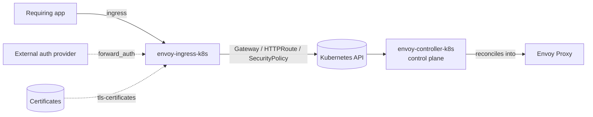
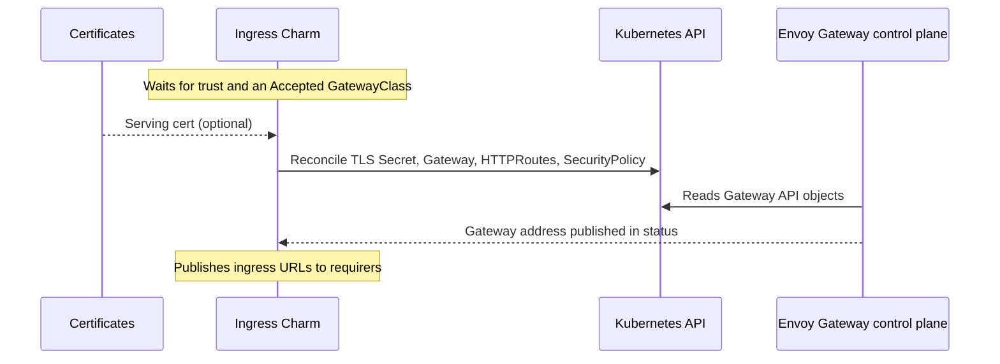

# Envoy Gateway Ingress

The Envoy Gateway Ingress charm (`envoy-ingress-k8s`) manages the user-facing
[Gateway API](https://gateway-api.sigs.k8s.io/) resources for an
[Envoy Gateway](https://gateway.envoyproxy.io/) control plane deployed by
`envoy-controller-k8s`. It gives related applications ingress by declaring a
`Gateway`, `HTTPRoute`s, and — for external auth — an Envoy Gateway
`SecurityPolicy`, then publishing the resulting URLs back to each requirer.

The charm has **no workload container**: it only writes Gateway API objects via
lightkube, referencing the shared `envoy` `GatewayClass` owned by the control
plane (the class name is the cross-charm contract; there is no relation between
the two charms). The control plane reconciles those objects into running Envoy
proxies.

## Relations

The order in which these are established does not matter. The charm reconciles
whenever the picture changes.

| Connects To | Interface | What It Does |
|-------------|-----------|--------------|
| **A requiring application** | `ingress` | Creates an `HTTPRoute` through the Gateway for the app and publishes its ingress URL. If two requirers ask for the same path, no route is created for either and the charm blocks. |
| **A certificates provider** (e.g. `self-signed-certificates`) | `tls-certificates` | Issues the serving cert for the Gateway's HTTPS listener. Optional: without it the Gateway serves HTTP only. |
| **An external auth provider** (e.g. `oauth2-proxy`) | `forward_auth` | Configures a `SecurityPolicy` with extAuth pointing at the provider so the Gateway enforces authentication. Optional. |
| **A downstream consumer** | `gateway_metadata` | Publishes Gateway info (name, namespace, service account) for consumers that need it. Optional. |

## How It Works

The charm reconciles the whole desired state on every event:

1. **Trust + discovery gate.** It needs cluster-scoped permissions (`juju trust`)
   to write resources, and it waits until the control plane's `envoy`
   `GatewayClass` reports `Accepted=True` before creating anything.
2. **TLS.** When a `certificates` relation is present, it mirrors the issued cert
   into a `kubernetes.io/tls` `Secret` and adds an HTTPS listener to the Gateway.
3. **Gateway + routes.** It declares the `Gateway` (HTTP listener always, HTTPS
   when certs exist) and one `HTTPRoute` per ingress relation, dropping any app
   whose generated path conflicts with another. With TLS, a companion HTTP route
   301-redirects plaintext traffic to HTTPS.
4. **External auth.** When `forward_auth` is related, it creates an Envoy Gateway
   `Backend` (the provider's FQDN) and a `SecurityPolicy` that applies extAuth to
   the Gateway.
5. **Publish.** It hands each requirer its ingress URL and publishes Gateway
   metadata to consumers.

## Lifecycle

## Configuration

See [`charmcraft.yaml`](charmcraft.yaml), or
[the charm on Charmhub](https://charmhub.io/envoy-ingress-k8s), for all config
options.
