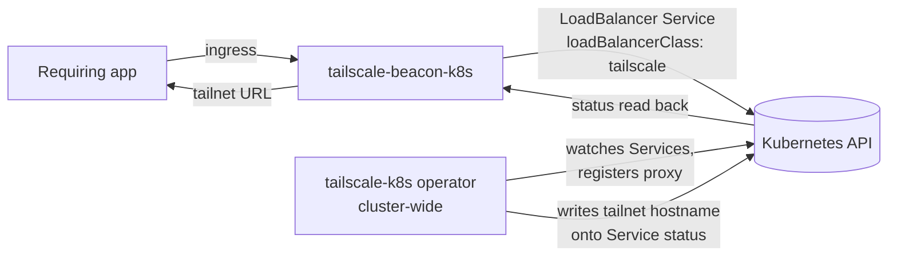

# Tailscale Beacon

The Tailscale Beacon charm (`tailscale-beacon-k8s`) exposes Kubernetes
workloads onto a [tailnet](https://tailscale.com/kb/1136/tailnet). It lives in a
user application's model and acts as the app's entrypoint to the tailnet.

When an application relates to it over the `ingress` relation, the beacon
declares a `LoadBalancer` `Service` with `loadBalancerClass: tailscale` for that
app. A cluster-wide Tailscale operator (deployed by `tailscale-k8s`) watches for
such Services, registers a proxy on the tailnet, and writes the resulting
tailnet hostname back onto the Service status. The beacon reads that hostname and
publishes the app's tailnet URL back to the requirer.

The charm has **no workload container**: it only writes Kubernetes `Service`
objects via lightkube. It is **useless on its own** — without a `tailscale-k8s`
operator running somewhere on the cluster, the Service it creates is never
reconciled onto the tailnet. This coupling is by design: the operator is the
single tailnet authority for the cluster. There is **no Juju relation** between
this charm and `tailscale-k8s`; coordination is implicit through the Service.

## Relations

| Connects To | Interface | What It Does |
|-------------|-----------|--------------|
| **A requiring application** | `ingress` | Creates a `LoadBalancer` Service (`loadBalancerClass: tailscale`) that exposes the app on the tailnet, and publishes the app's tailnet URL (`http://<tailnet-hostname>:<port>/`) back to the requirer. |

## How It Works

1. **Trust.** The charm needs cluster-scoped permissions (`juju trust`) to write
   and read Service resources via lightkube.
2. **Service creation.** For each `ingress` relation, it creates a
   `LoadBalancer` Service named `<app>-tailscale`, annotated with
   `tailscale.com/hostname: <model>-<app>` (model-qualified so the tailnet device
   name is unique across models, matching Traefik's `<model>-<app>` path-prefix
   order), selecting the app's pods (`app.kubernetes.io/name: <app>`) on the
   requested port.
3. **Operator reconciliation.** The cluster-wide Tailscale operator detects the
   Service, creates a proxy, joins it to the tailnet, and populates the Service
   status (`.status.loadBalancer.ingress` and a `TailscaleProxyReady` condition).
4. **Publish.** Once the tailnet hostname appears in the Service status, the
   charm publishes `http://<tailnet-hostname>:<port>/` back to the requirer.

## Status

The status is intentionally generic — per-app details (which proxies are
pending or which failed) are written to the unit log, not the status message,
so it stays readable no matter how many apps are related.

- **Active** — every related app's proxy has a tailnet address (or the charm is
  idle with no relations). When apps are exposed, the message names the tailnet.
- **Waiting** — one or more proxies are still coming up
  (`ProxyReady = ProxyPending`). The pending app names are logged. If a proxy
  stays pending past `ready-timeout`, a warning about possible device approval
  (`NeedsMachineAuth`) is logged; the charm remains in Waiting (it does not
  raise for a merely-slow proxy).
- **Blocked** — the charm has not been trusted (`juju trust tailscale-beacon-k8s`),
  or one or more proxies reported a terminal failure.
- **Error** — a proxy reported a terminal `ProxyInvalid`/`ProxyFailed`; the
  operator's message is surfaced as the exception, raised after the rest of the
  reconcile completes.

## Configuration

See [`charmcraft.yaml`](charmcraft.yaml) for all config options.
