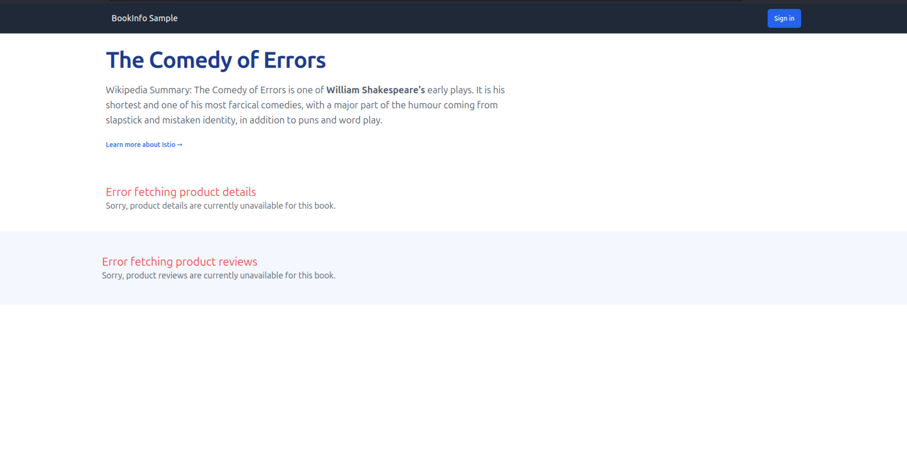

# Get started with Charmed Istio ambient

## Introduction

This tutorial demonstrates how to:
* deploy [Istio ambient](https://istio.io) using Charmed Istio
* put a microservice application on the mesh
* secure that application by:
  * establishing mTLS between all components
  * creating authorization policies that allow only the required communication, blocking any other entity from even reaching your components
To demonstrate this, we'll use the Istio [`Bookinfo`](https://istio.io/latest/docs/examples/bookinfo/) example application.

## Prerequisites

This tutorial assumes you have a [Juju](https://juju.is) controller bootstrapped on a 
[MicroK8s](https://microk8s.io/) cloud that is ready to use, on a 4 CPU, 8 GB node or better, with at least 40 GB disk space.
Typical setup using [snaps](https://snapcraft.io/) 
can be found in the [Juju docs](https://documentation.ubuntu.com/juju/3.6/howto/manage-your-deployment/).

This tutorial also assumes you have a basic knowledge of Juju.

## Configure MicroK8s

For this tutorial to go smoothly, make sure the following MicroK8s [addons](https://microk8s.io/docs/addons) are enabled: `dns`, `hostpath-storage`, and `metallb`.

You can check this with `microk8s status` and enable any missing addons.

<!-- vale off -->
## Deploy Charmed Istio
<!-- vale on -->

### Step 1: Set up the Istio system

Create a dedicated model for Istio components and deploy the core charms:

```bash
juju add-model istio-system
juju deploy istio-k8s --trust --channel 2/stable
juju deploy istio-ingress-k8s --trust --channel 2/stable
```

The [`istio-k8s`](https://charmhub.io/istio-k8s) charm deploys and manages the control plane of Istio ambient on Kubernetes, enabling you to configure and manage Istio through Juju.

The [`istio-ingress-k8s`](https://charmhub.io/istio-ingress-k8s) charm manages Istio ingress gateways in Kubernetes clusters and provides an ingress endpoint for charms that use it. 

### Step 2: Offer Istio ingress

As we've deployed a single central ingress for our applications, we must make that ingress accessible to other Juju models by [offering](https://documentation.ubuntu.com/juju/3.6/reference/juju-cli/list-of-juju-cli-commands/offer/) it:

```bash
juju offer istio-ingress-k8s:ingress,ingress-unauthenticated
```

<!-- vale off -->
## Deploy Charmed Bookinfo application
<!-- vale on -->

The Bookinfo application consists of three charms:
- **`bookinfo-productpage-k8s`**: Frontend charm that displays book information
- **`bookinfo-details-k8s`**: Backend charm that provides book details
- **`bookinfo-reviews-k8s`**: Backend charm that provides book reviews 

The Bookinfo example was chosen for this tutorial because:
- It's the official demo application used by Istio
- It's composed of multiple microservices that replicate a conventional web application and can be conveniently used to demonstrate various service mesh features

The Bookinfo application needs the `bookinfo-productpage-k8s` successfully communicating with the `bookinfo-details-k8s` and `bookinfo-reviews-k8s` for the web application to display all the relevant information without any errors.

```{mermaid}
flowchart LR
    user((User)) --> productpage[bookinfo-productpage-k8s]
    productpage --> details[bookinfo-details-k8s]
    productpage --> reviews[bookinfo-reviews-k8s]
```

### Step 3: Deploy application components

Create a model for the application and deploy the charms:

```bash
juju add-model bookinfo

# Deploy the charms
juju deploy bookinfo-productpage-k8s --trust
juju deploy bookinfo-details-k8s --trust
juju deploy bookinfo-reviews-k8s --trust

# Connect the charms
juju integrate bookinfo-productpage-k8s:details bookinfo-details-k8s:details
juju integrate bookinfo-productpage-k8s:reviews bookinfo-reviews-k8s:reviews

```

Now you can sit back and watch the deployment take place:

```bash
juju status --integrations --watch=5s
```

### Step 4: Configure external access

Expose the `bookinfo-productpage-k8s` using the `istio-ingress-k8s` ingress gateway. It is necessary to [consume](https://documentation.ubuntu.com/juju/3.6/reference/juju-cli/list-of-juju-cli-commands/consume/) `istio-ingress-k8s` from the `istio-system` model into the `bookinfo` model before adding the ingress relation.

```bash
juju consume istio-system.istio-ingress-k8s
juju integrate bookinfo-productpage-k8s istio-ingress-k8s:ingress
```

This ingress relation would allow the `bookinfo-productpage-k8s` charm to be accessed from outside the cluster, for example, your browser.

### Step 5: Access the application

Get the application URL and verify it's working:

```bash
juju run bookinfo-productpage-k8s/0 get-url
```

The URL will be of the form `http://INGRESS_IP/bookinfo-bookinfo-productpage-k8s/productpage?u=normal`.

Open the URL in your browser. You'll see the book information page.


## Secure with Service Mesh

Your application now works, but it:

* communicates over plain HTTP, meaning any sensitive data could be exposed if someone intercepts your traffic
* can be accessed by anything in your Kubernetes cluster

For example, if we `curl` from the productpage charm Pod we see it succeeds in many situations, even ones that are not necessary for our application:
```bash
# All endpoints are accessible with any HTTP method
juju exec -m bookinfo -u bookinfo-productpage-k8s/0 -- curl -s http://bookinfo-details-k8s.bookinfo.svc.cluster.local:9080/
juju exec -m bookinfo -u bookinfo-productpage-k8s/0 -- curl -s http://bookinfo-details-k8s.bookinfo.svc.cluster.local:9080/health
juju exec -m bookinfo -u bookinfo-productpage-k8s/0 -- curl -s http://bookinfo-details-k8s.bookinfo.svc.cluster.local:9080/details/1

# Even potentially dangerous methods like POST work
juju exec -m bookinfo -u bookinfo-productpage-k8s/0 -- curl -s -X POST http://bookinfo-details-k8s.bookinfo.svc.cluster.local:9080/details/1 -d '{}'
```

These issues can be solved with a [service mesh](../explanation/service-mesh.md).  Below, we demonstrate this with [Charmed Istio](../explanation/istio.md)

### Step 6: Add Services to the Mesh

Deploy the `istio-beacon-k8s` charm and connect it to the bookinfo backend charms:

```bash
juju deploy istio-beacon-k8s --channel 2/stable --trust
juju integrate bookinfo-details-k8s istio-beacon-k8s
juju integrate bookinfo-reviews-k8s istio-beacon-k8s
```

With the above commands, the `istio-beacon-k8s` charm 

- Adds the `bookinfo-details-k8s` and `bookinfo-reviews-k8s` charms to the Istio ambient mesh
- Applies [mTLS](https://istio.io/latest/blog/2023/secure-apps-with-istio/) for the traffic between the services in the mesh
- Applies a **deny-by-default** [authorization policy](https://istio.io/latest/docs/reference/config/security/authorization-policy/) which means traffic to anything on the mesh is denied unless explicitly allowed

With the mesh in place, all traffic between services flows through Istio ambient's **ztunnel** and **waypoint** components, which encrypt communication with mTLS and enforce authorization policies:

```{mermaid}
flowchart LR
    productpage[bookinfo-productpage-k8s] -->|plain| srczt[ztunnel]
    srczt -->|mTLS| wp[waypoint]
    wp -->|mTLS| dstzt[ztunnel]
    dstzt -->|plain| details[bookinfo-details-k8s]
    dstzt -->|plain| reviews[bookinfo-reviews-k8s]
```

To learn more about how traffic flows through the mesh, see the [Istio](../explanation/istio.md) and [Traffic authorization](../explanation/traffic-authorization.md) explanation docs.

Refresh the Bookinfo webpage in your browser - you'll notice that the details section and the reviews section are no longer accessible because the `bookinfo-productpage-k8s` charm is not authorized to communicate with them.



Add the `bookinfo-productpage-k8s` charm to the mesh to enable secure communication:

```bash
juju integrate bookinfo-productpage-k8s istio-beacon-k8s
```

The `istio-beacon-k8s` charm automatically creates authorization policies allowing `bookinfo-productpage-k8s` to access specific endpoints on the `bookinfo-details-k8s` and `bookinfo-reviews-k8s` charms via `GET` requests on port `9080`. Read [How to Add Mesh Support to your Charms](../how-to/add-mesh-support-to-your-charm.md) for details on how to automate authorization policy creation in your own charms.

Refresh the application - the missing sections should now be available again. With these few commands, you have:

- Secured the traffic between the services with mutual TLS (`mTLS`)
- Specified authorization policies so that the services can communicate only along the allowed traffic routes

## Verify the security configuration

With Charmed Istio authorization policies in place, access is now restricted. 
- The `bookinfo-details-k8s` charm allows access only to `/health` and `/details/*` endpoints for `GET` requests via port `9080` from authorized services
- The `bookinfo-reviews-k8s` charm allows access only to `/health` and `/reviews/*` endpoints for `GET` requests via port `9080` from authorized services

Verify the security restrictions:

```bash
# These still work - authorized endpoints with GET method
juju exec -m bookinfo -u bookinfo-productpage-k8s/0 -- curl -s http://bookinfo-details-k8s.bookinfo.svc.cluster.local:9080/health
juju exec -m bookinfo -u bookinfo-productpage-k8s/0 -- curl -s http://bookinfo-details-k8s.bookinfo.svc.cluster.local:9080/details/1

# These are now blocked - unauthorized endpoint or method
juju exec -m bookinfo -u bookinfo-productpage-k8s/0 -- curl -s http://bookinfo-details-k8s.bookinfo.svc.cluster.local:9080/
juju exec -m bookinfo -u bookinfo-productpage-k8s/0 -- curl -s -X POST http://bookinfo-details-k8s.bookinfo.svc.cluster.local:9080/details/1 -d '{}'
```

Notice how the same commands that worked before are now properly restricted based on endpoint and HTTP method.

## Troubleshooting

If you encounter issues during the deployment:

1. Check the status of all charms:
   ```bash
   juju status --integrations
   ```

2. Verify the Istio components are running:
   ```bash
   kubectl get pods -n istio-system
   ```

3. Check if the application pods are running:
   ```bash
   kubectl get pods -n bookinfo 
   ```

4. Review the Juju debug logs for any issues:
   ```bash
   juju debug-log --include istio-beacon-k8s
   ```

## Summary

Congratulations! You've successfully:

- Deployed Charmed Istio ambient
- Deployed the Charmed Bookinfo web application  
- Secured the application with mesh integration
- Configured fine-grained authorization policies

## Teardown

```{tip}
If you're planning to continue with other tutorials, such as:
* [Use Istio ambient across different Juju models](./use-the-istio-mesh-across-different-juju-models.md)
* [Authenticated Ingress with the Canonical Identity Platform](../how-to/authenticated-ingress-with-the-canonical-identity-platform.md)

don't tear anything down yet.  Those tutorials build on this one.  Keep everything deployed until you know you don't need it.
```

To clean up the resources created in this tutorial, run:

```bash
juju destroy-model bookinfo
juju destroy-model istio-system
```

## Next steps

To further explore Charmed Istio capabilities:

- Continue with [Getting Started with Charmed Istio ambient: Cross-Model](../tutorial/use-the-istio-mesh-across-different-juju-models.md) to deploy part of the Bookinfo application in a separate model
- Visualize your service mesh with the [Monitor Istio ambient using Kiali](../how-to/monitor-the-istio-mesh-using-kiali.md) guide
