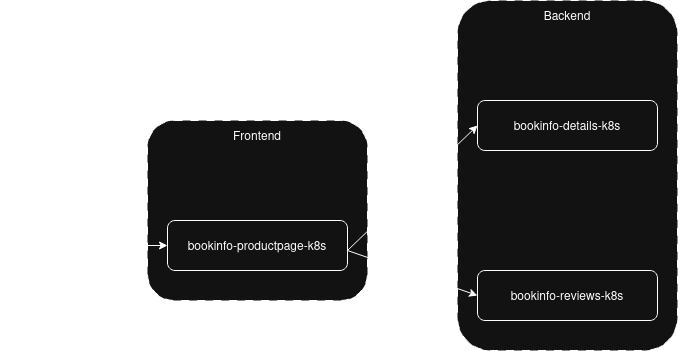
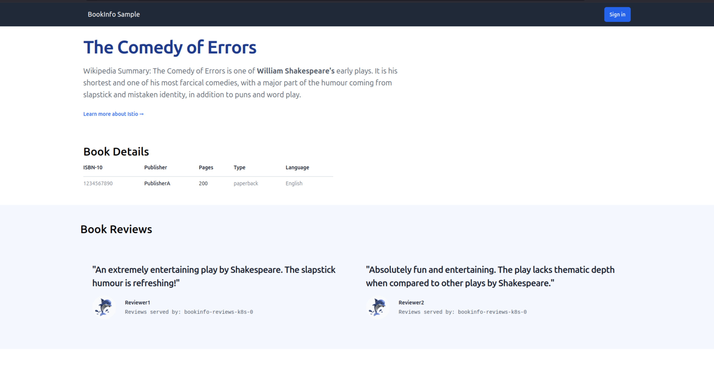
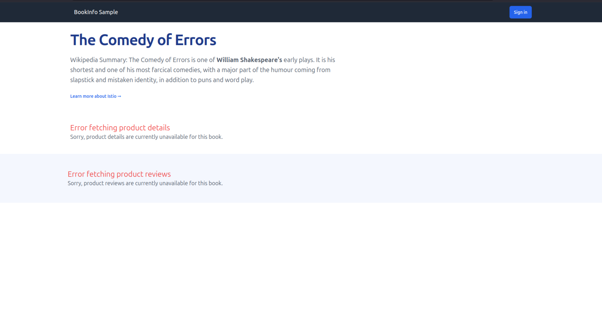

# Get Started with the Charmed Istio Service Mesh

## Introduction

This tutorial demonstrates how to:
* deploy the [Istio](https://istio.io) service mesh using Charmed Istio
* put a microservice application on the mesh
* secure that application by:
  * establishing mTLS between all components
  * creating authorization policies that allow only the required communication, blocking any other entity from even reaching your components
To demonstrate this, we'll use the Istio [`Bookinfo`](https://istio.io/latest/docs/examples/bookinfo/) example application.

## Prerequisites

This tutorial assumes you have a [Juju](https://juju.is) controller bootstrapped on a 
[MicroK8s](https://microk8s.io/) cloud that is ready to use, on a 4 CPU, 8 GB node or better, with at least 40 GB disk space.
Typical setup using [snaps](https://snapcraft.io/) 
can be found in the [Juju docs](https://documentation.ubuntu.com/juju/3.6/howto/manage-your-deployment/).

This tutorial also assumes you have a basic knowledge of Juju.

## Configure MicroK8s

For this tutorial to go smoothly, make sure the following MicroK8s [addons](https://microk8s.io/docs/addons) are enabled: `dns`, `hostpath-storage`, and `metallb`.

You can check this with `microk8s status` and enable any missing addons.

## Deploy Charmed Istio

### Step 1: Set up the Istio System

Create a dedicated model for Istio components and deploy the core charms:

```{note}
The channels of the charms in the tutorial are currently pinned edge channels to include certain bug fixes and features from the corresponding charm required to efficiently demonstrate service-mesh capabilities.
```

```bash
juju add-model istio-system
juju deploy istio-k8s --trust --channel 2/edge
juju deploy istio-ingress-k8s --trust --channel 2/edge
```

The [`istio-k8s`](https://charmhub.io/istio-k8s) charm deploys and manages the control plane of an Istio service mesh on Kubernetes, enabling you to configure and manage Istio through Juju.

The [`istio-ingress-k8s`](https://charmhub.io/istio-ingress-k8s) charm manages Istio ingress gateways in Kubernetes clusters and provides an ingress endpoint for charms that use it. 

### Step 2: Offer Istio Ingress

As we've deployed a single central ingress for our applications, we must make that ingress accessible to other Juju models by [offering](https://documentation.ubuntu.com/juju/3.6/reference/juju-cli/list-of-juju-cli-commands/offer/) it:

```bash
juju offer istio-ingress-k8s:ingress
```


## Deploy Charmed Bookinfo Application

The Bookinfo application consists of three charms:
- **`bookinfo-productpage-k8s`**: Frontend charm that displays book information
- **`bookinfo-details-k8s`**: Backend charm that provides book details
- **`bookinfo-reviews-k8s`**: Backend charm that provides book reviews 

The Bookinfo example was chosen for this tutorial because:
- It's the official demo application used by Istio
- It's composed of multiple microservices that replicate a conventional web application and can be conveniently used to demonstrate various service mesh features

The Bookinfo application needs the `bookinfo-productpage-k8s` successfully communicating with the `bookinfo-details-k8s` and `bookinfo-reviews-k8s` for the web application to display all the relevant information without any errors.



### Step 3: Deploy Application Components

Create a model for the application and deploy the charms:

```bash
juju add-model bookinfo

# Deploy the charms
juju deploy bookinfo-productpage-k8s 
juju deploy bookinfo-details-k8s
juju deploy bookinfo-reviews-k8s

# Connect the charms
juju integrate bookinfo-productpage-k8s:details bookinfo-details-k8s:details
juju integrate bookinfo-productpage-k8s:reviews bookinfo-reviews-k8s:reviews

```

Now you can sit back and watch the deployment take place:

```bash
juju status --integrations --watch=5s
```

### Step 4: Configure External Access

Expose the `bookinfo-productpage-k8s` using the `istio-ingress-k8s` ingress gateway. It is necessary to [consume](https://documentation.ubuntu.com/juju/3.6/reference/juju-cli/list-of-juju-cli-commands/consume/) `istio-ingress-k8s` from the `istio-system` model into the `bookinfo` model before adding the ingress relation.

```bash
juju consume istio-system.istio-ingress-k8s
juju integrate bookinfo-productpage-k8s istio-ingress-k8s:ingress
```

This ingress relation would allow the `bookinfo-productpage-k8s` charm to be accessed from outside the cluster, for example, your browser.

### Step 5: Access the Application

Get the application URL and verify it's working:

```bash
juju run bookinfo-productpage-k8s/0 get-url
```

Open the URL in your browser. You'll see the book information page.



## Why Do We Need Charmed Istio?

While the application works, it has critical security vulnerabilities:

### Communication Between Workloads Is Not Encrypted by Default

All microservice communication happens over plain HTTP. This means sensitive data is exposed to anyone with network access and can be intercepted or modified.

While Kubernetes supports [manual TLS configuration](https://kubernetes.io/docs/tasks/tls/), managing certificates for each microservice becomes exponentially complex as your architecture scales - requiring certificate generation, distribution, rotation, and troubleshooting across potentially hundreds of services.

### Unrestricted Service Communication

Every service can access every other service without restrictions. If an attacker compromises one service, they immediately gain access to your entire application. You can verify this unrestricted access:

```bash
# All endpoints are accessible with any HTTP method
juju exec -m bookinfo -u bookinfo-productpage-k8s/0 -- curl -s http://bookinfo-details-k8s.bookinfo.svc.cluster.local:9080/
juju exec -m bookinfo -u bookinfo-productpage-k8s/0 -- curl -s http://bookinfo-details-k8s.bookinfo.svc.cluster.local:9080/health
juju exec -m bookinfo -u bookinfo-productpage-k8s/0 -- curl -s http://bookinfo-details-k8s.bookinfo.svc.cluster.local:9080/details/1

# Even potentially dangerous methods like POST work
juju exec -m bookinfo -u bookinfo-productpage-k8s/0 -- curl -s -X POST http://bookinfo-details-k8s.bookinfo.svc.cluster.local:9080/details/1 -d '{}'
```

While Kubernetes provides some network controls to partly address this, Istio provides a richer [AuthorizationPolicy](https://istio.io/latest/docs/reference/config/security/authorization-policy/) object that lets you define:
- Which workloads can communicate with which 
- Specifically how they can communicate (what HTTP methods are allowed, endpoints can be accessed, etc)

So for example, through Istio we could say:
- `PodA` is allowed to talk to `PodB` using `GET` and `POST` on port `1234`
- nobody is allowed to talk to `PodC`

### The Charmed Istio Solution

Charmed Istio automatically provides:
- **mTLS encryption** between all charmed workloads on the mesh without manual certificate management
- **Fine-grained authorization policies** defining exactly which services can communicate
- **Simplified Day 2 operations** where most common authorization policies are created automatically just by establishing existing Juju relations

Let's secure our application with Charmed Istio.

## Secure with Service Mesh

### Step 6: Add Services to the Mesh

Deploy the `istio-beacon-k8s` charm and connect it to the bookinfo backend charms:

```bash
juju deploy istio-beacon-k8s --channel 2/edge
juju integrate bookinfo-details-k8s istio-beacon-k8s
juju integrate bookinfo-reviews-k8s istio-beacon-k8s
```

With the above two simple commands, the `istio-beacon-k8s` charm 

- Adds the `bookinfo-details-k8s` and `bookinfo-reviews-k8s` charms to the Istio service mesh
- Applies [mTLS](https://istio.io/latest/blog/2023/secure-apps-with-istio/) for the traffic between the services in the mesh
- Applies a **deny-by-default** [authorization policy](https://istio.io/latest/docs/reference/config/security/authorization-policy/) which means traffic to anything on the mesh is denied unless explicitly allowed

Refresh the Bookinfo webpage in your browser - you'll notice that the details section and the reviews section are no longer accessible because the `bookinfo-productpage-k8s` charm is not authorized to communicate with them.



Add the `bookinfo-productpage-k8s` charm to the mesh to enable secure communication:

```bash
juju integrate bookinfo-productpage-k8s istio-beacon-k8s
```

The `istio-beacon-k8s` charm automatically creates authorization policies allowing `bookinfo-productpage-k8s` to access specific endpoints on the `bookinfo-details-k8s` and `bookinfo-reviews-k8s` charms via `GET` requests on port `9080`. Check the [How-To](../how-to/index.md) section for details on how to add support for Charmed Istio in your own charm and define authorization policies.

Refresh the application - the missing sections should now be available again. With these few commands, you have:

- Secured the traffic between the services with mutual TLS (`mTLS`)
- Specified authorization policies so that the services can communicate only along the allowed traffic routes

## Verify the Security Configuration

With Charmed Istio authorization policies in place, access is now restricted. 
- The `bookinfo-details-k8s` charm allows access only to `/health` and `/details/*` endpoints for `GET` requests via port `9080` from authorized services
- The `bookinfo-reviews-k8s` charm allows access only to `/health` and `/reviews/*` endpoints for `GET` requests via port `9080` from authorized services

Verify the security restrictions:

```bash
# These still work - authorized endpoints with GET method
juju exec -m bookinfo -u bookinfo-productpage-k8s/0 -- curl -s http://bookinfo-details-k8s.bookinfo.svc.cluster.local:9080/health
juju exec -m bookinfo -u bookinfo-productpage-k8s/0 -- curl -s http://bookinfo-details-k8s.bookinfo.svc.cluster.local:9080/details/1

# These are now blocked - unauthorized endpoint or method
juju exec -m bookinfo -u bookinfo-productpage-k8s/0 -- curl -s http://bookinfo-details-k8s.bookinfo.svc.cluster.local:9080/
juju exec -m bookinfo -u bookinfo-productpage-k8s/0 -- curl -s -X POST http://bookinfo-details-k8s.bookinfo.svc.cluster.local:9080/details/1 -d '{}'
```

Notice how the same commands that worked before are now properly restricted based on endpoint and HTTP method.

## Troubleshooting

If you encounter issues during the deployment:

1. Check the status of all charms:
   ```bash
   juju status --integrations
   ```

2. Verify the Istio components are running:
   ```bash
   kubectl get pods -n istio-system
   ```

3. Check if the application pods are running:
   ```bash
   kubectl get pods -n bookinfo 
   ```

4. Review the Juju debug logs for any issues:
   ```bash
   juju debug-log --include istio-beacon-k8s
   ```

## Summary

Congratulations! You've successfully:

- Deployed Charmed Istio service mesh
- Deployed the Charmed Bookinfo web application  
- Secured the application with mesh integration
- Configured fine-grained authorization policies

```{tip}
If you're planning to continue with the [Getting Started with Charmed Istio: Cross-Model Mesh](./getting-started-with-istio-cross-model-mesh.md) tutorial, keep both models running as it builds upon this deployment.
```

## Teardown

To clean up the resources created in this tutorial, run:

```bash
juju destroy-model bookinfo
juju destroy-model istio-system
```

## Next Steps

To further explore Charmed Istio capabilities:

- Continue with [Getting Started with Charmed Istio: Cross-Model Mesh](./getting-started-with-istio-cross-model-mesh.md) to deploy part of the Bookinfo application in a separate model
- Visualize your service mesh in the [Getting Started with Kiali](./getting-started-with-kiali.md) tutorial 
