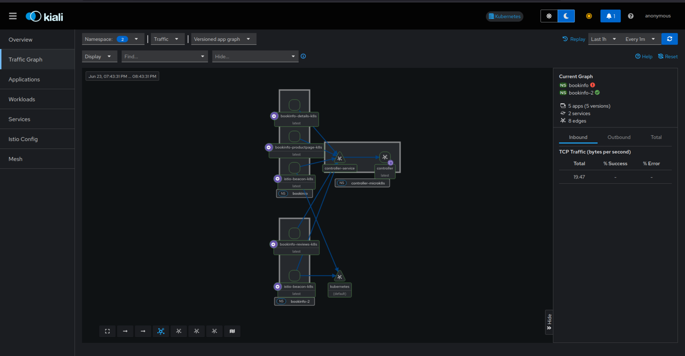

# Monitor the Istio Mesh using Kiali

This tutorial demonstrates how to deploy and configure [Kiali](https://kiali.io) to observe your Charmed Istio service mesh. You'll learn how to visualize your mesh topology, monitor traffic flow, and gain insights into your distributed applications.

## Introduction

Kiali is a management console for an [Istio](https://istio.io) service mesh that provides visualization through a modern web interface. The `kiali-k8s` charm simplifies the deployment and integration of Kiali with [Charmed Istio](./getting-started-with-istio-mesh.md), offering:

- Service mesh topology visualization
- Traffic flow monitoring
- Health status indicators
- Configuration validation

In this tutorial, you'll deploy Charmed Kiali to observe the Charmed Istio and the [Charmed Bookinfo](./getting-started-with-istio-mesh.md#deploy-charmed-bookinfo-application) application from the previous tutorials, enabling you to visualize and monitor your service mesh in real-time.

```{note}
To keep this tutorial simple and provide an easy way to get started with Kiali, the focus here is majorly about using Kiali to collect and visualize metrics only from a single component of Istio (the istio-k8s charm). There are other types of Istio metrics that can also be visualized in Kiali which will be covered in the following tutorial.
```

## Prerequisites

Before starting this tutorial, ensure you have:

- **Completed Tutorials**:
  - [Getting Started with Charmed Istio Service Mesh](./getting-started-with-istio-mesh.md)
- **Working Deployment**: Charmed Istio deployed in the `istio-system` model
- **Juju Knowledge**: Basic familiarity with [Juju cross-model relations](https://documentation.ubuntu.com/juju/stable/reference/cross-model-integration/)

## Prepare the Istio System

### Step 1: Collect Metrics from Istio

Kiali works by observing the metrics generated by Istio. Switch to the `istio-system` model and deploy a metrics store to collect metrics from Istio:

```bash
juju switch istio-system
juju deploy prometheus-k8s --trust --channel=2/edge

juju integrate istio-k8s prometheus-k8s
```

```{note}
This metrics store doesn't need to be dedicated to Istio - it could also be the general metrics store used for the full [Canonical Observability Stack](https://documentation.ubuntu.com/observability/).
```

### Step 2: Offer Istio Metadata and Metrics

Make the Istio metadata and Prometheus metrics available for cross-model consumption. Both the `istio-metadata` and the `prometheus-api` relations will be later used by the `kiali-k8s` charms for visualizing the service mesh.

```bash
juju offer istio-k8s:istio-metadata
juju offer prometheus-k8s:prometheus-api
```

## Deploy Charmed Kiali

### Step 3: Create a Model for Kiali

Create a dedicated model and deploy the `kiali-k8s` charm:

```bash
juju add-model kiali
juju deploy kiali-k8s --trust --channel=2/edge
```

### Step 4: Connect Kiali to Istio

To provide Kiali with knowledge about our Charmed Istio and provide it with access to Istio metrics, we integrate with the `istio-k8s` and the `prometheus-k8s` charms in the `istio-system` model:

```bash
juju consume istio-system.istio-k8s
juju integrate kiali-k8s:istio-metadata istio-k8s

juju consume istio-system.prometheus-k8s
juju integrate kiali-k8s:prometheus prometheus-k8s
```

### Step 5: Expose Kiali via Ingress

To make Kiali accessible from outside the Kubernetes cluster, for example, from your browser, connect Kiali to the Istio ingress:

```bash
juju consume istio-system.istio-ingress-k8s
juju integrate kiali-k8s istio-ingress-k8s
```

Now you can sit back and watch the deployment take place:

```bash
juju status --integrations --watch=5s
```

## Access the Kiali Dashboard

Once the deployment is complete, Kiali will be available at:

```
http://INGRESS_IP/kiali-kiali-k8s
```

Where:
- `INGRESS_IP` is the IP address from the `istio-ingress-k8s` status message
- The path follows the pattern: `/NAMESPACE-APPNAME`

To get the ingress IP:

```bash
juju status -m istio-system istio-ingress-k8s
```

Open the URL in your browser to access the Kiali dashboard:



## Troubleshooting

If Kiali is not accessible or showing data:

1. Verify all integrations are active:
   ```bash
   juju status -m kiali --integrations
   ```

2. Ensure Istio is generating telemetry:
   ```bash
   kubectl get telemetry -A
   ```

3. Review Kiali logs for errors:
   ```bash
   juju debug-log -m kiali --include kiali-k8s
   ```

## Summary

Congratulations! You've successfully:

- Deployed Prometheus to collect Istio metrics
- Deployed Charmed Kiali for service mesh visualization
- Configured cross-model integrations between Kiali, Istio, and Prometheus
- Accessed the Kiali dashboard to visualize your service mesh

With Kiali, you now have powerful visualization capabilities for your Istio service mesh, enabling you to monitor, troubleshoot, and optimize your distributed applications.

## Teardown

To clean up the resources created in this tutorial, run:

```bash
juju destroy-model kiali
```

To clean up all resources from the entire tutorial series, you can also run:
```bash
juju destroy-model bookinfo
juju destroy-model bookinfo-2
juju destroy-model istio-system
```
