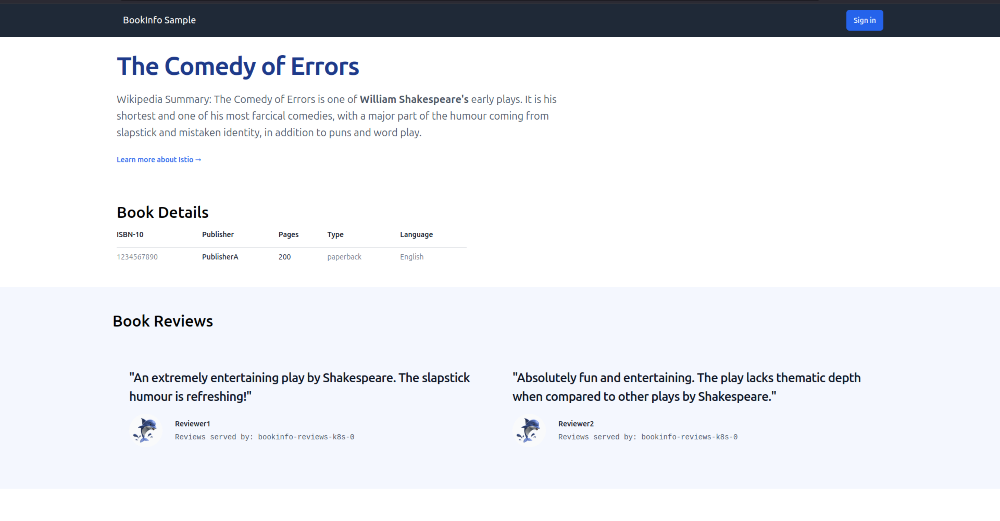

<!-- vale off -->

# Use Istio ambient across different Juju models

<!-- vale on -->

This tutorial demonstrates how to extend your Istio ambient mesh across multiple Juju models, enabling secure communication between charms deployed in different models. You'll learn how to create authorization policies and establish cross-model relations through Charmed Istio.

## Introduction

In this tutorial, we'll continue working with the charmed [`Bookinfo`](https://istio.io/latest/docs/examples/bookinfo/) application and extend the setup from the [previous tutorial](./get-started-with-the-charmed-istio-mesh.md). 

We'll move a backend charm ([`bookinfo-reviews-k8s`](https://charmhub.io/bookinfo-reviews-k8s)) into a separate Juju model and [securely](../explanation/service-mesh.md#why-do-i-need-a-service-mesh) connect it to the frontend charm across model boundaries.

## Prerequisites

Before starting this tutorial, ensure you have:

- Completed the [Get started with Charmed Istio ambient](./get-started-with-the-charmed-istio-mesh.md) tutorial
- Basic familiarity with [Juju cross-model relations](https://documentation.ubuntu.com/juju/stable/reference/cross-model-integration/) (CMR)

## Deploy the reviews charm in a new model

<!-- vale off -->

### Step 1: Remove the `bookinfo-reviews-k8s` charm

<!-- vale on -->

Remove the `bookinfo-reviews-k8s` charm from the `bookinfo` model so it can be deployed in a different model to demonstrate cross-model communications through Charmed Istio:

```bash
# Switch to the bookinfo model if that's not your current Juju model
juju switch bookinfo

juju remove-application bookinfo-reviews-k8s
```

<!-- vale off -->

### Step 2: Create a new Juju model

<!-- vale on -->

Let's create a separate model for the `bookinfo-reviews-k8s` charm and deploy it in that Juju model:

```bash
juju add-model bookinfo-2
juju deploy bookinfo-reviews-k8s --trust
```
<!-- vale off -->

### Step 3: Deploy Istio Beacon in the new model

<!-- vale on -->

Similar to the `bookinfo` model in the previous tutorial, let's deploy the `istio-beacon-k8s` charm into this model so the `bookinfo-reviews-k8s` charm can be added to the service mesh:

```bash
juju deploy istio-beacon-k8s --trust --channel=2/stable
```

```{note}
While it's possible to use a single `istio-beacon-k8s` charm across multiple models, it's recommended to deploy one beacon per Juju model for better isolation and management. This tutorial follows the recommended approach.
```

### Step 4: Add the reviews charm to the mesh

Integrate the `bookinfo-reviews-k8s` charm with the beacon to add it to the service mesh:

```bash
juju integrate bookinfo-reviews-k8s istio-beacon-k8s
```

## Configure cross-model relations

### Step 5: Offer the reviews charm

Make the `bookinfo-reviews-k8s` charm available to other models by [offering](https://documentation.ubuntu.com/juju/3.6/reference/juju-cli/list-of-juju-cli-commands/offer/) it:

```bash
juju offer bookinfo-reviews-k8s:reviews,provide-cmr-mesh
```

This command offers two relations:
- **`reviews`**: The application-specific relation for connecting the frontend [`bookinfo-productpage-k8s`](https://charmhub.io/bookinfo-productpage-k8s) with the backend `bookinfo-reviews-k8s` charm
- **`provide-cmr-mesh`**: A service mesh relation that allows applications in other Juju models to make HTTP calls to this charm via the service mesh

### Step 6: Consume and connect the reviews charm

Switch back to the original `bookinfo` model, [consume](https://documentation.ubuntu.com/juju/3.6/reference/juju-cli/list-of-juju-cli-commands/consume/) the `bookinfo-reviews-k8s` charm from the `bookinfo-2` Juju model and establish the cross-model connections:

```bash
juju switch bookinfo
juju consume bookinfo-2.bookinfo-reviews-k8s
juju integrate bookinfo-productpage-k8s:require-cmr-mesh bookinfo-reviews-k8s:provide-cmr-mesh
juju integrate bookinfo-productpage-k8s:reviews bookinfo-reviews-k8s:reviews
```

The first integration establishes the service mesh connection, while the second creates the application-level relationship between the charms.

```{note}
It is important to note that the asymmetric `provide-cmr-mesh` and `require-cmr-mesh` relations between two charms are required only when they need to be added to the mesh and they are in different models. For two charms in the same model, this relation is not required, as can be seen in the previous tutorial.
```

### Step 7: Verify the deployment

After the integrations are complete, refresh your `Bookinfo` webpage in your browser. The behavior of the web application itself should remain the same, and the app should successfully display the details and reviews of the book.



This time, you have:

- Secured the traffic between services using mTLS across two Juju models
- Restricted the traffic between the `bookinfo-productpage-k8s` and the `bookinfo-reviews-k8s` using [authorization policies](https://istio.io/latest/docs/reference/config/security/authorization-policy/) across two Juju models

## Verify the security configuration

Similar to the security verification in the [previous tutorial](./get-started-with-the-charmed-istio-mesh.md#verify-the-security-configuration), we can verify that authorization policies are properly enforced across model boundaries.

With Charmed Istio authorization policies in place, the `bookinfo-reviews-k8s` charm allows access only to `/health` and `/reviews/*` endpoints for `GET` requests via port `9080` from authorized services.

Verify the security restrictions:

```bash
# These still work - authorized endpoints with GET method
juju exec -m bookinfo -u bookinfo-productpage-k8s/0 -- curl -s http://bookinfo-reviews-k8s.bookinfo-2.svc.cluster.local:9080/health
juju exec -m bookinfo -u bookinfo-productpage-k8s/0 -- curl -s http://bookinfo-reviews-k8s.bookinfo-2.svc.cluster.local:9080/reviews/1

# These are now blocked - unauthorized endpoint or method
juju exec -m bookinfo -u bookinfo-productpage-k8s/0 -- curl -s http://bookinfo-reviews-k8s.bookinfo-2.svc.cluster.local:9080/
juju exec -m bookinfo -u bookinfo-productpage-k8s/0 -- curl -s -X POST http://bookinfo-reviews-k8s.bookinfo-2.svc.cluster.local:9080/reviews/1 -d '{}'
```

Notice how the same commands that worked before are now properly restricted based on endpoint and HTTP method, even across model boundaries.

## Troubleshooting

If the reviews section doesn't appear or you encounter issues:

1. Check the status of both models:
   ```bash
   juju status -m bookinfo --integrations
   juju status -m bookinfo-2 --integrations
   ```

2. Verify the cross-model relations:
   ```bash
   juju offers
   juju consumed
   ```

3. Verify pods are running in both namespaces:
   ```bash
   kubectl get pods -n bookinfo
   kubectl get pods -n bookinfo-2
   ```

4. Review the beacon logs for cross-model issues:
   ```bash
   juju debug-log -m bookinfo --include istio-beacon-k8s
   juju debug-log -m bookinfo-2 --include istio-beacon-k8s
   ```

## Summary

Congratulations! You've successfully:

- Moved a microservice of the `Bookinfo` application into a separate Juju model
- Established secure cross-model relations through Charmed Istio
- Configured automatic authorization policies for cross-model communication
- Verified that security policies are enforced across model boundaries

This demonstrates how Charmed Istio enables you to build distributed applications across multiple Juju models while maintaining strong security boundaries and simplified operations.

```{tip}
If you're planning to continue with the [Monitor Istio ambient using Kiali](../how-to/monitor-the-istio-mesh-using-kiali.md) guide, keep all models running as Kiali will observe the entire mesh topology.
```

## Teardown

To clean up the resources created in this tutorial, run:

```bash
juju destroy-model bookinfo-2
```

If you also want to clean up the resources from the previous tutorial, you can run:
```bash
juju destroy-model bookinfo
juju destroy-model istio-system
```

## Next steps

To further explore Charmed Istio capabilities:

- Visualize your service mesh with the [Monitor Istio ambient using Kiali](../how-to/monitor-the-istio-mesh-using-kiali.md) guide

