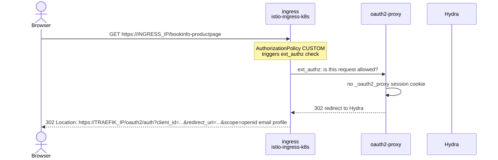
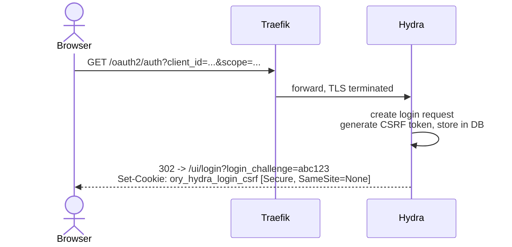
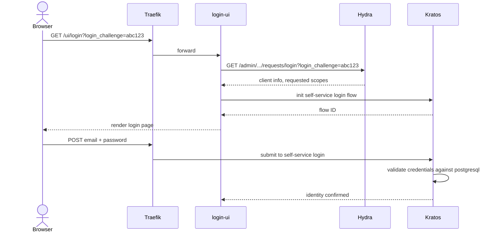
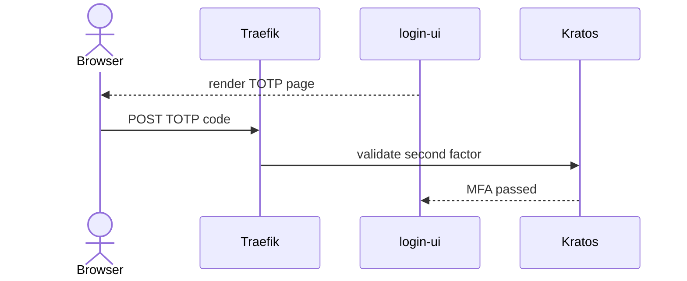
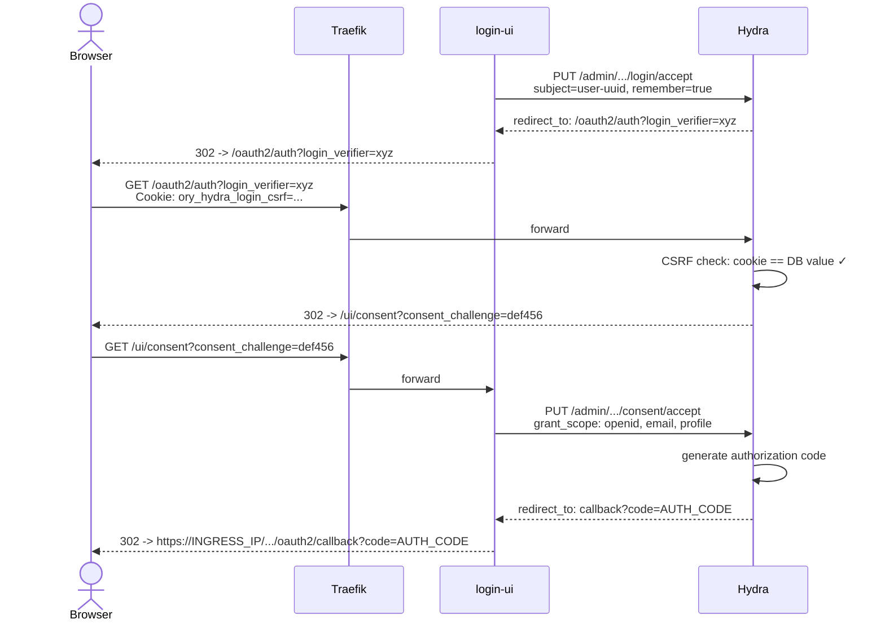
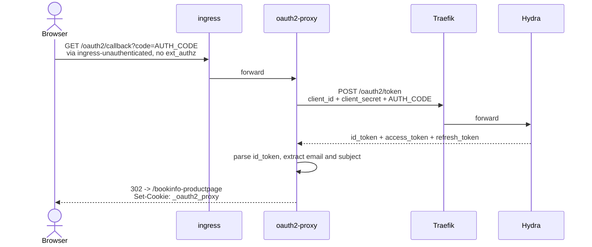
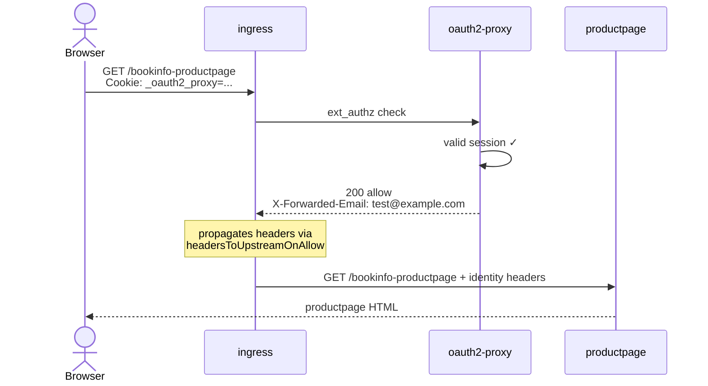

# Browser Auth Flow

How a browser request to a protected app (bookinfo productpage) gets authenticated
through the Charmed Istio Ambient + IAM stack.

Reference setup: `justfiles/setup.just`

## Components

| Component | Model | Role |
|---|---|---|
| istio-k8s | istio-system | mesh control plane, holds ext_authz config |
| ingress (istio-ingress-k8s) | bookinfo | gateway, enforces ext_authz via AuthorizationPolicy |
| oauth2-proxy | bookinfo | ext_authz decision maker, drives OAuth2 flow |
| traefik | iam | TLS-terminating reverse proxy for IAM services |
| hydra | iam | OAuth2/OIDC provider, issues tokens |
| login-ui | iam | web frontend for login/consent, brokers Hydra + Kratos |
| kratos | iam | identity store, validates credentials |

## Why Traefik?

The IAM charms (hydra, kratos, login-ui) dropped support for the generic `ingress`
interface (IPA) in mid-2025 and now only expose a `public-route` relation using the
`traefik_route` interface. This means they can only be fronted by Traefik, not by
Istio ingress or any other ingress provider directly.

Until the IAM charms either revive the generic ingress interface or add support for
`istio-ingress-route`, Traefik is a required component in this setup.

## Step 1: Unauthenticated request hits ext_authz

The browser hits productpage. Envoy intercepts and asks oauth2-proxy
if the request is allowed. No session cookie exists, so oauth2-proxy
redirects to Hydra.

The ext_authz provider is configured through two relations:
- `oauth2-proxy:forward-auth` -> `ingress:forward-auth` passes the decisions address
- `ingress:istio-ingress-config` -> `istio-k8s:istio-ingress-config` registers the provider in mesh config

The `ingress` endpoint on istio-ingress is the authenticated route.
The `ingress-unauthenticated` endpoint bypasses ext_authz entirely.
oauth2-proxy's own callback uses this to avoid an infinite auth loop.

## Step 2: Hydra starts the login flow

Hydra receives the OAuth2 authorization request. It doesn't authenticate
users itself, it delegates to Login UI via a login challenge.

The CSRF cookie ties this browser session to the login request in the DB.
Hydra must NOT run in dev mode over TLS. Dev mode omits the `Secure` flag,
and browsers reject `SameSite=None` cookies without `Secure`.

Hydra knows the login URL from the `ui-endpoint-info` relation.
Login UI advertises `https://TRAEFIK_IP/ui/login`. The HTTPS is
hardcoded by `normalise_url` in the login-ui charm, which is why
Traefik must have TLS.

## Step 3: Login UI authenticates the user via Kratos

Login UI receives the login challenge, checks with Hydra what's being
requested, then runs the user through Kratos authentication.

If `enforce_mfa=True` on Kratos (the default), an extra round trip happens:

## Step 4: Login accepted, CSRF check, consent

Login UI tells Hydra the user is authenticated. The browser is redirected
back to Hydra, which validates the CSRF cookie and moves to consent.

The consent step asks "does the user allow this client to access their data?"
In this setup, login-ui auto-accepts without prompting the user.

## Step 5: Token exchange and session

oauth2-proxy receives the authorization code, exchanges it for tokens,
and sets a session cookie.

oauth2-proxy knows Hydra's token endpoint and its own client credentials
from the cross-model `oauth` relation. Hydra registered the OAuth2 client
when the relation was established. The only client in this setup is
oauth2-proxy itself. Users are not OAuth2 clients, they exist in Kratos.

The three tokens:
- **id_token** (JWT): who is the user. Contains email, subject. This is what oauth2-proxy reads to set headers.
- **access_token** (JWT): what the client can do. Contains granted scopes. Used for API calls on behalf of the user.
- **refresh_token** (opaque): how to get fresh tokens without re-authenticating. Keeps the session alive long-term.

## Step 6: Authenticated request

The browser retries with the session cookie. oauth2-proxy validates it
and tells Envoy to allow the request, setting identity headers.

The headers oauth2-proxy sets are propagated upstream because the
`forward-auth` relation passes them to istio-ingress, which passes
them to istio-k8s via `istio-ingress-config`. istio-k8s writes them
into the mesh config as `headersToUpstreamOnAllow` on the ext_authz provider.
