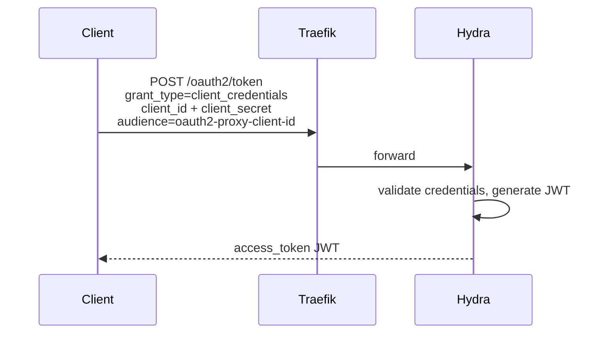
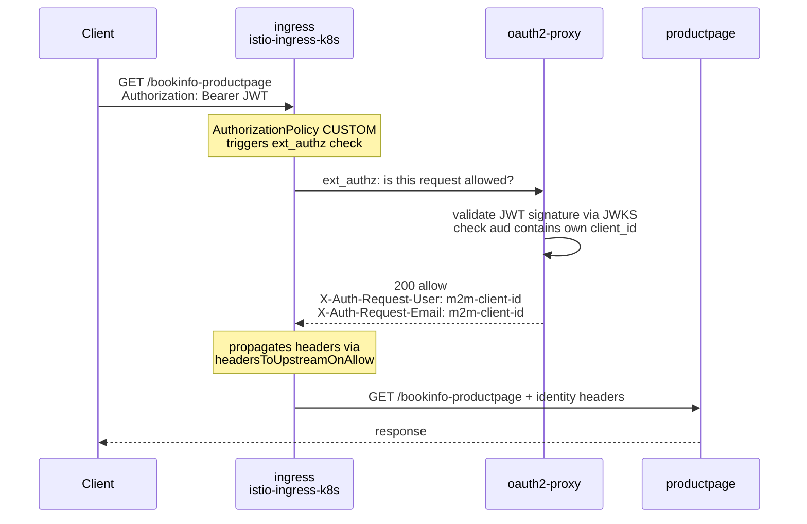

# Client Credentials Flow

How a programmatic client authenticates with the IAM setup to access a
protected app, without a browser or user interaction.

Requires the browser auth setup from `justfiles/setup.just` to be deployed.

Reference setup: `justfiles/client-credentials.just`

## Prerequisites

The browser auth flow must already be working. This flow reuses the same
ext_authz path but with a Bearer JWT instead of a session cookie.

Two additional steps are needed:

1. Enable `enable_jwt_bearer_tokens` on oauth2-proxy so it accepts Bearer JWTs
2. Register a `client_credentials` client in Hydra with the right audience

## What is a client_credentials client?

In the browser flow, the only OAuth2 client is oauth2-proxy itself. It was
registered by Hydra when the cross-model `oauth` relation was established.
Users are not OAuth2 clients, they exist in Kratos.

A client_credentials client is a machine-to-machine identity. It has a
client_id and client_secret, but no associated user. It gets tokens directly
from Hydra without going through login, consent, or Kratos.

## Step 1: Enable JWT bearer tokens

By default, oauth2-proxy only accepts session cookies. Setting
`enable_jwt_bearer_tokens=true` makes it also validate Bearer JWTs in the
Authorization header.

Under the hood this sets `OAUTH2_PROXY_SKIP_JWT_BEARER_TOKENS=true` on the
oauth2-proxy workload. When a request arrives with a Bearer token, oauth2-proxy
validates the JWT signature against Hydra's JWKS endpoint instead of looking
for a session cookie.

## Step 2: Register a client in Hydra

The client is created via Hydra's admin API using the CLI inside the hydra pod.

```
hydra create oauth2-client \
    --endpoint http://localhost:4445 \
    --name "test-m2m-client" \
    --grant-type client_credentials \
    --response-type token \
    --scope openid \
    --audience <oauth2-proxy-client-id> \
    --access-token-strategy jwt
```

Two details matter:

- `--audience` must be set to oauth2-proxy's own client_id. oauth2-proxy
  validates that the JWT's `aud` claim contains its client_id. Without this,
  the token is rejected with `audience from claim aud with value [] does not
  match with any of allowed audiences`.
- `--access-token-strategy jwt` makes Hydra issue JWTs instead of opaque
  tokens. oauth2-proxy needs a JWT it can verify against the JWKS endpoint.

The oauth2-proxy client_id comes from the `oauth` relation data on
oauth2-proxy. It was assigned by Hydra when the relation was established.

## Step 3: Get a token

The client exchanges its credentials for a JWT at Hydra's token endpoint.



The JWT payload looks like:

```json
{
    "aud": ["<oauth2-proxy-client-id>"],
    "client_id": "<m2m-client-id>",
    "iss": "https://<traefik-ip>",
    "sub": "<m2m-client-id>",
    "scp": ["openid"],
    "exp": 1772768395,
    "iat": 1772764795
}
```

No `email`, no `name`, no user identity. The `sub` claim is the client_id.

## Step 4: Access the protected app

The client sends the JWT as a Bearer token. The request goes through the
same ext_authz path as the browser flow.



## What headers reach the backend?

oauth2-proxy sets the same headers as in the browser flow, but the values
come from the JWT claims:

| Header | Value | Source claim |
|---|---|---|
| X-Auth-Request-User | m2m-client-id | sub |
| X-Auth-Request-Email | m2m-client-id | sub (fallback, no email claim) |
| X-Auth-Request-Access-Token | the full JWT | access_token |

These headers are configured in the mesh config under
`headersToUpstreamOnAllow` on the ext_authz provider, set through the
`forward-auth` -> `istio-ingress-config` relation chain.

## Limitations

### Service mesh concern

- No custom headers. The headers oauth2-proxy sets are hardcoded in the
  `auth_proxy` charm lib as `ALLOWED_HEADERS`. There is no technical reason
  for this restriction. oauth2-proxy itself supports arbitrary headers
  via `--set-xauthrequest` and `--pass-access-token`. The charm lib
  artificially limits the options to a fixed list. Allowing the requirer
  to specify custom headers through the forward-auth relation would remove
  this limitation without needing RequestAuthentication. For claim-to-header
  mapping that bypasses oauth2-proxy entirely, Istio's RequestAuthentication
  can do this with `outputClaimToHeaders`, see
  [request-authentication-findings.md](request-authentication-findings.md).

### Not a service mesh concern

- No user identity in client_credentials JWTs. The `sub` claim is the
  client_id, not a user email or username. This is how OAuth2
  client_credentials works by design. Mapping M2M clients to user
  identities (e.g. so Kubeflow can identify the same user across browser
  and programmatic access) is an IAM/application concern.
- Audience coupling. The m2m client must know the oauth2-proxy client_id
  at registration time. If oauth2-proxy is redeployed and gets a new
  client_id, all m2m clients need to be re-registered. This is OAuth2
  client management, handled by the IAM stack.
- What claims to put in the JWT (custom scopes, email, groups) is
  determined by Hydra's token configuration and the OAuth2 client
  setup. The mesh only transports whatever claims exist.
