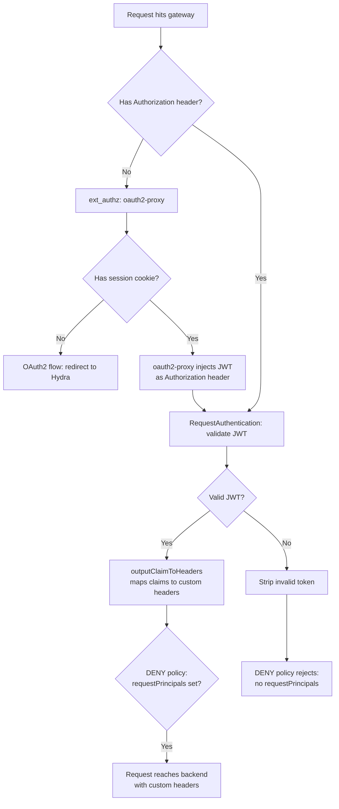

# Requestauthentication findings

Findings from investigating how to add JWT validation via Istio's
RequestAuthentication to the existing ext_authz setup, and what charm
changes would be needed.

## Background

The current setup uses ext_authz (oauth2-proxy) for all authentication.
This works for both browser flows (session cookies) and programmatic
access (Bearer JWTs when `enable_jwt_bearer_tokens` is enabled).

The problem: oauth2-proxy sets identity headers from a hardcoded list
(`ALLOWED_HEADERS` in the auth_proxy lib). There is no way to set
custom headers like `kubeflow-userid` through the charm interface.
For client_credentials JWTs, both `X-Auth-Request-User` and
`X-Auth-Request-Email` contain the client_id UUID, not a user identity.

## Kubeflow's approach

Kubeflow uses RequestAuthentication alongside ext_authz, not instead of it.
Three Istio resources work together on the same gateway:

**RequestAuthentication** validates JWTs and maps claims to custom headers:

```yaml
apiVersion: security.istio.io/v1beta1
kind: RequestAuthentication
metadata:
  name: dex-jwt
  namespace: istio-system
spec:
  selector:
    matchLabels:
      app: istio-ingressgateway
  jwtRules:
  - issuer: http://dex.auth.svc.cluster.local:5556/dex
    forwardOriginalToken: true
    outputClaimToHeaders:
    - header: kubeflow-userid
      claim: email
    - header: kubeflow-groups
      claim: groups
```

**AuthorizationPolicy CUSTOM** sends requests to ext_authz, but only
when there is no Authorization header:

```yaml
apiVersion: security.istio.io/v1beta1
kind: AuthorizationPolicy
metadata:
  name: istio-ingressgateway-oauth2-proxy
  namespace: istio-system
spec:
  action: CUSTOM
  provider:
    name: oauth2-proxy
  selector:
    matchLabels:
      app: istio-ingressgateway
  rules:
  - when:
    - key: request.headers[authorization]
      notValues: ["*"]
    to:
    - operation:
        notPaths:
        - /dex/*
        - /dex/**
        - /oauth2/*
```

**AuthorizationPolicy DENY** rejects any request without a valid JWT
principal (set by RequestAuthentication after validating a JWT):

```yaml
apiVersion: security.istio.io/v1beta1
kind: AuthorizationPolicy
metadata:
  name: istio-ingressgateway-require-jwt
  namespace: istio-system
spec:
  action: DENY
  selector:
    matchLabels:
      app: istio-ingressgateway
  rules:
  - from:
    - source:
        notRequestPrincipals: ["*"]
    to:
    - operation:
        notPaths:
        - /dex/*
        - /dex/**
        - /oauth2/*
```

Source: https://github.com/kubeflow/manifests/tree/v1.11-branch/common/oauth2-proxy/components/istio-external-auth

## The critical detail: OAuth2-proxy injects the JWT

The key insight from the Kubeflow DENY policy comment:

> "even user requests that have been authenticated by oauth2-proxy
> will have a JWT, because oauth2-proxy injects a Dex JWT into the
> request."

oauth2-proxy is configured with `OAUTH2_PROXY_SET_AUTHORIZATION_HEADER=true`.
When it approves a request (browser flow with session cookie), it injects
the id_token as `Authorization: Bearer <jwt>` into the ext_authz allow
response. Envoy puts that header on the request before it continues
through the filter chain.

This means RequestAuthentication sees a JWT on **every** authenticated
request, regardless of whether it started as a browser or API request.
The `outputClaimToHeaders` mapping works uniformly for both flows.

The current oauth2-proxy charm does NOT set this flag. It only sets
`OAUTH2_PROXY_SET_XAUTHREQUEST=true` (which produces the
`X-Auth-Request-*` headers). Adding `SET_AUTHORIZATION_HEADER` is
required for this pattern to work.

## How forward-auth and request-auth work in tandem

The three resources form a pipeline, not two separate paths:

**Browser flow (no Authorization header):**
1. CUSTOM policy fires (no auth header matches `notValues: ["*"]`)
2. ext_authz sends request to oauth2-proxy
3. oauth2-proxy validates session cookie, returns 200 with
   `Authorization: Bearer <id_token>` header (injected JWT)
4. Envoy puts the Authorization header on the request
5. RequestAuthentication validates the JWT, sets `requestPrincipals`,
   maps claims to custom headers via `outputClaimToHeaders`
6. DENY policy passes (requestPrincipals is set)
7. Request reaches backend with custom headers

**API flow (has Authorization header):**
1. CUSTOM policy does NOT fire (auth header present, `notValues`
   condition not met)
2. RequestAuthentication validates the JWT, sets `requestPrincipals`,
   maps claims to custom headers
3. DENY policy passes (requestPrincipals is set)
4. Request reaches backend with custom headers

**Invalid JWT:**
1. CUSTOM policy does NOT fire (auth header present)
2. RequestAuthentication strips the invalid token
3. DENY policy rejects (`notRequestPrincipals: ["*"]` matches
   because no valid principal was set)

**No cookie, no JWT (first visit):**
1. CUSTOM policy fires (no auth header)
2. ext_authz sends to oauth2-proxy
3. oauth2-proxy has no session, returns 302 redirect to Hydra
4. OAuth2 flow begins



The DENY policy is essential. Without it, a request with a stripped
invalid JWT would have no Authorization header and no session cookie,
but would not be redirected to ext_authz (the CUSTOM policy already
evaluated). The DENY policy catches this case.

## Gateway endpoints

The existing istio-ingress-k8s endpoints remain unchanged:

| Endpoint | Auth applied |
|---|---|
| `ingress` | ext_authz (browser) + RequestAuthentication (JWT) |
| `ingress-unauthenticated` | neither, excluded via notPaths |

Apps connecting via `ingress` get both auth paths transparently.
Apps on `ingress-unauthenticated` (like oauth2-proxy's callback)
bypass both, same as today.

## Implementation plan

Based on how upstream Kubeflow solves this, with three changes needed
across two charms:

### 1. OAuth2-proxy charm: inject JWT on allow

Enable `OAUTH2_PROXY_SET_AUTHORIZATION_HEADER=true` so that browser-flow
requests get the id_token injected as a Bearer token. This is what makes
RequestAuthentication work for browser users, not just API clients.

This could be a new config option on the oauth2-proxy charm, or always-on
when forward-auth is active. Without this, RequestAuthentication only
works for the API/JWT flow.

### 2. Istio-ingress charm: requestauthentication resource

A new `request-auth` relation on istio-ingress-k8s where the consuming
app provides its claim-to-header mappings. Only the app knows what
headers it needs (e.g. Kubeflow needs `email` -> `kubeflow-userid`).

What claims exist in the JWT (email, groups, custom attributes) is
determined by the IAM stack and OAuth2 client configuration, not by
the mesh. The mesh only maps existing claims to headers.

When the relation is active, the charm would:

1. Create a RequestAuthentication resource targeting its gateway, using
   the claim-to-header mappings from the relation and the issuer/JWKS
   from the forward-auth path (oauth2-proxy already has these from its
   oauth relation with Hydra)
2. Add a `notValues: ["*"]` condition on `request.headers[authorization]`
   to the existing ext_authz AuthorizationPolicy so requests with a
   Bearer token skip ext_authz and go through RequestAuthentication
3. Create a DENY AuthorizationPolicy with `notRequestPrincipals: ["*"]`
   as a safety net to reject requests that fail JWT validation

The `request-auth` relation is optional. Without it, everything works
exactly as it does today. The `ingress` and `ingress-unauthenticated`
endpoints are unchanged.

### 3. Forward-auth lib: pass oidc discovery info

The forward-auth lib would need to also pass `issuer_url` and
`jwks_uri`, which it currently does not. RequestAuthentication needs
these to validate JWTs. oauth2-proxy already has them from its `oauth`
relation with Hydra.

## Jwks endpoint and TLS trust

RequestAuthentication needs to fetch JWKS from the OIDC provider.
In this setup, the JWKS endpoint is behind Traefik with a self-signed
cert. The gateway won't trust it, and there is no `insecureSkipVerify`
option on RequestAuthentication.

This means RequestAuthentication cannot be tested in this dev setup
without resolving the TLS trust issue first. The client-credentials
flow (see [Client-credentials-flow.md](client-credentials-flow.md))
works because oauth2-proxy runs inside the cluster and is configured
to trust the CA. The gateway has no such configuration today.

To unblock this, either:
- Add a `receive-ca-cert` relation to istio-ingress-k8s so the gateway
  can be configured to trust the self-signed CA
- Use an external IAM stack with a commercial certificate that the
  gateway trusts out of the box