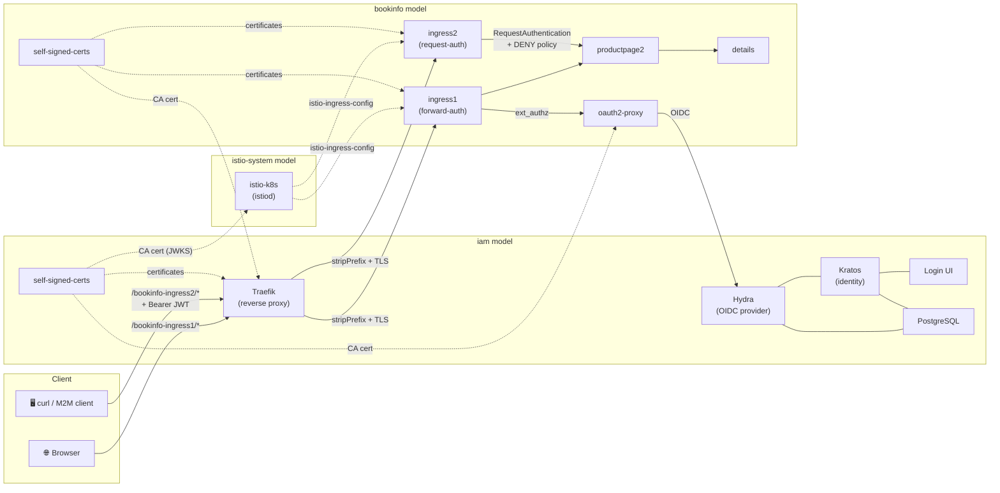
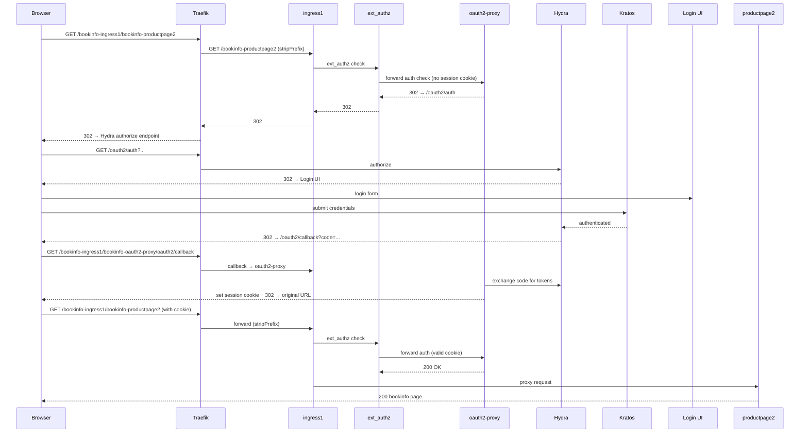
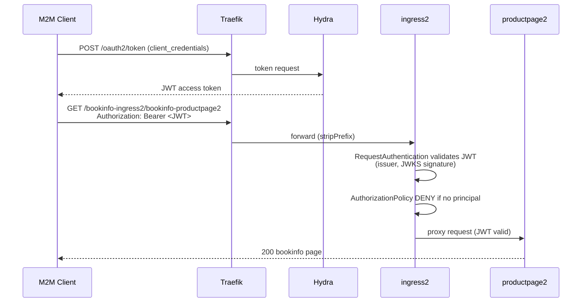
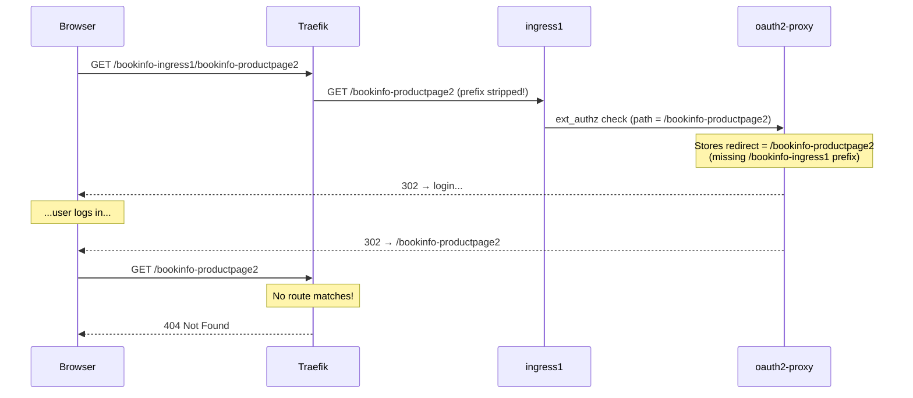
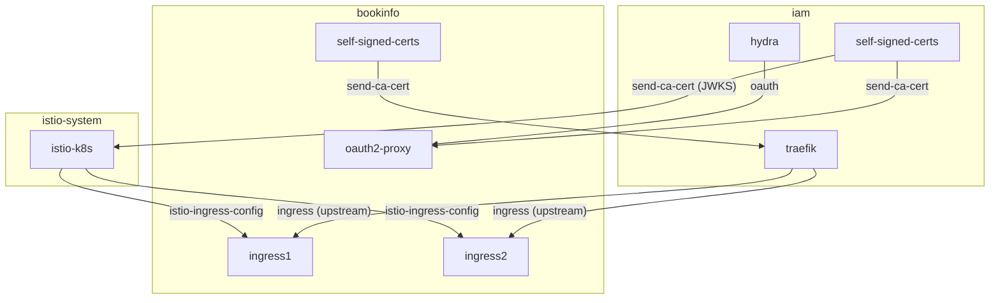

# Dual Istio Ingress via Traefik

This setup tests two Istio ingress gateways sitting behind a single Traefik reverse proxy, each enforcing a different authentication mechanism:

- **ingress1** — Browser-based OAuth2/OIDC login (forward-auth via oauth2-proxy → Hydra/Kratos)
- **ingress2** — Machine-to-machine JWT validation (Istio RequestAuthentication + AuthorizationPolicy)

Both gateways route to the same backend (`productpage2`), demonstrating that a single application can be exposed through multiple auth strategies simultaneously.

## Architecture



## Three-Model Layout

| Model | Purpose | Key Charms |
|-------|---------|------------|
| `istio-system` | Istio control plane | `istio-k8s` |
| `iam` | Identity & Access Management | `hydra`, `kratos`, `login-ui`, `traefik`, `postgresql`, `self-signed-certs` |
| `bookinfo` | Application + dual gateways | `ingress1`, `ingress2`, `oauth2-proxy`, `productpage2`, `details`, `self-signed-certs` |

## Auth Flows

### Browser Auth (ingress1)



### JWT / M2M Auth (ingress2)



## Quick Start

```bash
# Prerequisites: juju bootstrapped on microk8s with dns, hostpath-storage, metallb

# Deploy everything (takes ~20 min)
just -f ingress_chain.just setup

# Create a test user for browser login
juju run -m iam kratos/0 create-admin-account username=admin email=test@example.com
# → use the recovery link + code to set a password

# Create an M2M client for JWT auth
just -f ingress_chain.just create-m2m-client
# → note the client_id and client_secret

# Get a JWT token
just -f ingress_chain.just get-token <client_id> <client_secret>

# Test browser auth (should 302 → login)
curl -ksSo /dev/null -w '%{http_code}' https://<TRAEFIK_IP>/bookinfo-ingress1/bookinfo-productpage2

# Test JWT auth (should 200 with valid token, 403 without)
curl -ksS https://<TRAEFIK_IP>/bookinfo-ingress2/bookinfo-productpage2 \
    -H "Authorization: Bearer <TOKEN>"

# Tear down
just -f ingress_chain.just teardown
```

## Enabling Domain / Hostname Routing

By default, the setup uses Traefik's LoadBalancer IP directly. To switch to domain-based routing (e.g. `app.example.com`):

```bash
just -f ingress_chain.just enable-hostname
```

This recipe does three things:

1. **Sets `external_hostname`** on Traefik so it advertises routes under the domain
2. **Patches CoreDNS** with a `hosts` block so in-cluster pods (oauth2-proxy, kratos, istiod) can resolve the domain to Traefik's ClusterIP
3. **Updates JWT config** on productpage2 so the `jwt-issuer` matches Hydra's issuer under the domain (`https://app.example.com`)

When using a domain, you also need a local `/etc/hosts` entry on your machine:
```
<TRAEFIK_EXTERNAL_IP>  app.example.com
```

> **Note:** The CoreDNS patch is necessary because there is no real DNS record for the domain. Without it, oauth2-proxy cannot reach Hydra's OIDC discovery endpoint and istiod cannot fetch the JWKS keys for JWT validation.

## Workaround: EnvoyFilter for `X-Forwarded-Uri`

### The Problem

When Traefik sits in front of Istio ingress, it uses `stripPrefix` to remove the path prefix (e.g. `/bookinfo-ingress1`) before forwarding. This breaks the browser auth redirect flow:

1. User visits `https://traefik/bookinfo-ingress1/bookinfo-productpage2`
2. Traefik strips prefix, forwards to ingress1 as `/bookinfo-productpage2`
3. Istio's ext_authz sends the request to oauth2-proxy for auth check
4. oauth2-proxy sees only the stripped path and stores it as the post-login redirect target
5. After login, oauth2-proxy redirects to `/bookinfo-productpage2` — missing the `/bookinfo-ingress1` prefix
6. Traefik doesn't recognise this path → **404**



### The Fix

An EnvoyFilter injects a Lua script that runs **before** the ext_authz check. It reads the `X-Forwarded-Prefix` header (set by Traefik's stripPrefix middleware) and combines it with the request path into `X-Forwarded-Uri`. oauth2-proxy then uses this full path for the redirect.

This also requires that the Istio mesh ConfigMap includes `x-forwarded-prefix` and `x-forwarded-uri` in `includeRequestHeadersInCheck` so ext_authz forwards these headers. The `istio-ingress-k8s` charm's `DEFAULT_INCLUDE_HEADERS_IN_CHECK` list has been extended to include these headers.

### EnvoyFilter Manifest

```yaml
apiVersion: networking.istio.io/v1alpha3
kind: EnvoyFilter
metadata:
  name: set-x-forwarded-uri
  namespace: bookinfo
spec:
  workloadSelector:
    labels:
      gateway.networking.k8s.io/gateway-name: ingress1
  configPatches:
  - applyTo: HTTP_FILTER
    match:
      context: GATEWAY
      listener:
        filterChain:
          filter:
            name: envoy.filters.network.http_connection_manager
            subFilter:
              name: envoy.filters.http.ext_authz
    patch:
      operation: INSERT_BEFORE
      value:
        name: envoy.filters.http.lua
        typed_config:
          "@type": type.googleapis.com/envoy.extensions.filters.http.lua.v3.Lua
          inline_code: |
            function envoy_on_request(handle)
              local prefix = handle:headers():get("x-forwarded-prefix")
              if prefix then
                local path = handle:headers():get(":path")
                handle:headers():replace("x-forwarded-uri", prefix .. path)
              end
            end
```

### Where the Actual Fix Belongs

**This EnvoyFilter is a workaround.** The proper fix should live in one of two places:

1. **Traefik** — should set `X-Forwarded-Uri` to the original full path (before stripPrefix) when forwarding. This is the most correct place since Traefik is the one stripping the prefix and has the original path.
2. **oauth2-proxy** — should reconstruct the full redirect URI from `X-Forwarded-Prefix` + the request path, rather than relying on `X-Forwarded-Uri`. Some oauth2-proxy forks/versions already support this.

Until one of these is implemented, the EnvoyFilter workaround is required for any chained ingress setup where Traefik strips a path prefix before forwarding to Istio.

## Cross-Model Relations



## Known Issues & Notes

- **`self-signed-certs` must be `1/stable`** — V0 `certificate-transfer` format is incompatible with istio/traefik
- **IAM charms must be `latest/stable`** — `latest/edge` has a kratos `identifier_first` login method that login-ui doesn't support
- **`oauth2-proxy dev=true`** — the charm ignores `receive-ca-cert` relation data; `dev=true` sets `SSL_INSECURE_SKIP_VERIFY` as a workaround
- **`kratos dev=true`** — needed for HTTP communication internally between kratos and other IAM charms
- **`kratos enforce_mfa=false`** — disable MFA for simpler testing (password-only login)
- **Ingress status collector** — rev 72 of `istio-ingress-k8s` has a slow status collector (blocking `_is_deployment_ready` in `collect_unit_status`). Charms still come up but take much longer. Fix: [canonical/istio-ingress-k8s-operator#165](https://github.com/canonical/istio-ingress-k8s-operator/pull/165)
